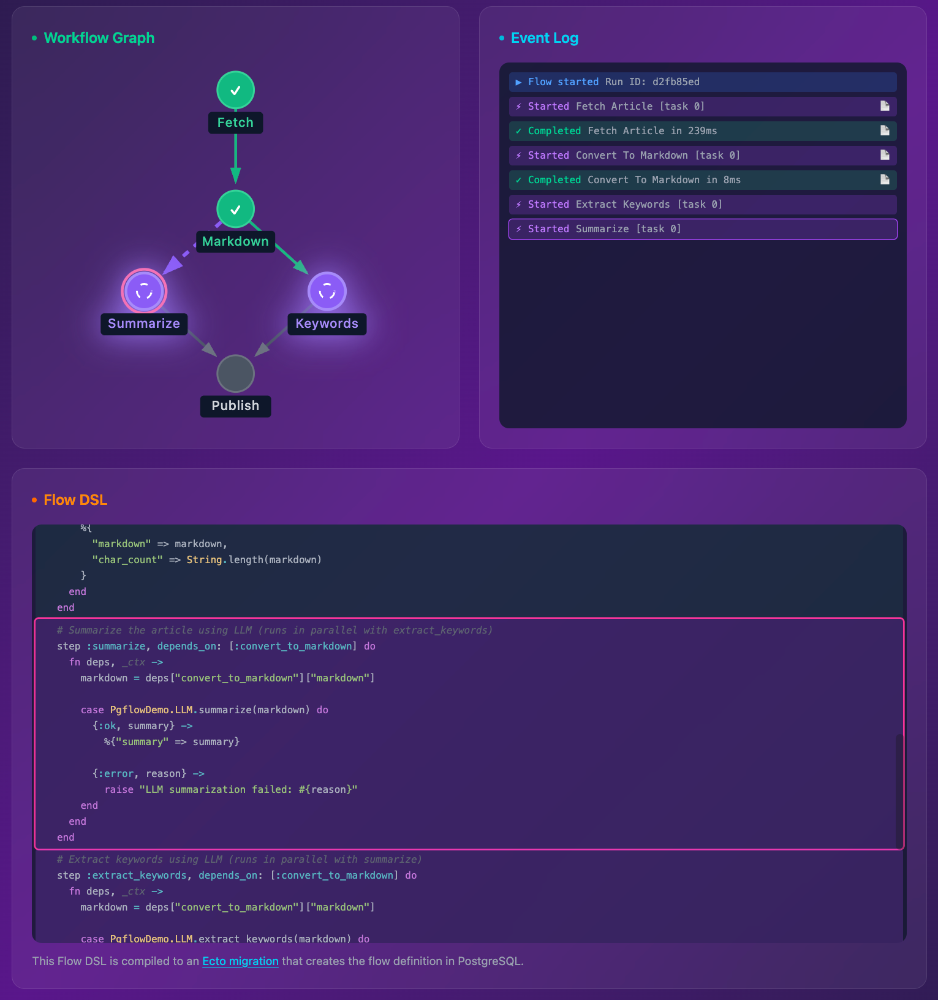

# PgFlow

Workflows, background and cron jobs in Elixir and Postgres powered by PGMQ

A native Elixir implementation of [pgflow](https://pgflow.dev) — a PostgreSQL-based workflow engine built on [pgmq](https://github.com/pgmq/pgmq). Define multi-step DAG workflows ("flows") or simple one-off background jobs ("jobs") — both backed by the same PostgreSQL queuing infrastructure with retries, visibility timeouts, and delivery guarantees. Elixir workers are thin polling clients. This implementation attempts to be compatible with the existing TypeScript/Deno [pgflow](https://github.com/pgflow-dev/pgflow) project, sharing the same database schema and SQL functions.



## Why PgFlow?

- **No extra infrastructure** - Runs entirely in PostgreSQL using pgmq. No Redis, no external queue service, no Oban.
- **Queryable state** - All workflow state lives in SQL tables. Debug with `SELECT * FROM pgflow.runs`.
- **Automatic retries** - Failed steps retry with exponential backoff. Only failed steps retry, not the whole workflow.
- **Parallel processing** - Steps run concurrently when dependencies allow. Fan-out with `map` for array processing.
- **Cross-language** - Same flows can be processed by Elixir or Deno (Supabase) workers side-by-side.

```
                              ┌─────────────┐
                         ┌───▶│  summarize  │───┐
┌───────────┐   ┌──────────┐  └─────────────┘   │  ┌─────────┐
│   fetch   │──▶│ convert  │                    ├─▶│ publish │
└───────────┘   └──────────┘  ┌─────────────┐   │  └─────────┘
                         └───▶│  keywords   │───┘
                              └─────────────┘
```

## Comparison with Alternatives

### Elixir Workflow Engines

| Aspect | [PgFlow](https://github.com/pgflow-dev/pgflow) | [Oban](https://github.com/oban-bg/oban) | [Oban Pro Workflow](https://hexdocs.pm/oban) | [Broadway](https://github.com/dashbitco/broadway) | [Gust](https://github.com/marciok/gust) | [Handoff](https://github.com/polvalente/handoff) | [Reactor](https://github.com/ash-project/reactor) | [FlowStone](https://github.com/nshkrdotcom/flowstone) | [Durable](https://github.com/wavezync/durable) | [Journey](https://github.com/shipworthy/journey) |
|---|---|---|---|---|---|---|---|---|---|---|
| **License** | Open source | Open source | Paid | Open source | Open source | Open source | Open source | Open source | Open source | Open source |
| **Focus** | Cross-language workflow DAGs | Background jobs with cron | DAG workflows for Oban users | Kafka/SQS data pipelines | Airflow-like DAGs with UI | Distributed cluster DAGs | Saga orchestration with rollback | Asset-first ETL pipelines | Temporal-style event workflows | Durable graph workflows with introspection |
| **Coordination** | Database (pgmq) | Database (Oban) | Database (Oban) | In-memory (GenStage) | Application (Elixir) | Erlang cluster | In-process | Database (Oban) | Database (PostgreSQL) | Database (PostgreSQL) |
| **Dependencies** | First-class `depends_on` | Manual enqueue | First-class `deps` | Pipeline stages | `downstream` option | Explicit `args` refs | Spark DSL `argument` | First-class `depends_on` | Pipeline (sequential) | Explicit list in `compute` |
| **Fan-out/Fan-in** | Built-in map steps | Manual | Built-in patterns | Partitioned batches | Manual task chains | Manual DAG build | Manual composition | Partition-based | ForEach with concurrency | Manual composition |
| **State Storage** | PostgreSQL (durable) | PostgreSQL (durable) | PostgreSQL (durable) | In-memory | PostgreSQL | In-memory | In-memory | PG/S3/Parquet | PostgreSQL (durable) | PostgreSQL (durable) |
| **Cross-platform** | Yes (TS + Elixir) | Elixir only | Elixir only | Elixir only | Elixir only | Elixir only | Elixir only | Elixir only | Elixir only | Elixir only |
| **Compensation** | Retry with backoff | Retry with backoff | Retry + dep options | N/A | Retry | Max retries | Full saga undo | Retry (via Oban) | Saga rollback + retry | Retry with recovery |
| **Scheduling** | External (pg_cron) | Built-in Oban.Cron | Built-in Oban.Cron | N/A | Built-in cron | N/A | N/A | Via Oban | Built-in cron | Built-in tick nodes |
| **Web UI** | Optional LiveView | Oban.Web (paid) | Oban.Web (paid) | N/A | Included | N/A | N/A | LiveView dashboard | N/A | CLI introspection + analytics |
| **Resource-aware** | No | No | No | Demand-based | No | Yes (cost maps) | No | No | No | No |
| **Dynamic steps** | No | N/A | Yes (grafting) | N/A | No | No | Yes (runtime) | No | Yes (branching) | Yes (conditional logic) |

### Other Workflow Engines

| Aspect | [PgFlow](https://github.com/pgflow-dev/pgflow) | [Temporal](https://github.com/temporalio/temporal) | [Inngest](https://github.com/inngest/inngest) | [DBOS](https://github.com/dbos-inc/dbos-transact-ts) | [Trigger.dev](https://github.com/triggerdotdev/trigger.dev) | [Vercel Workflows](https://vercel.com/docs/workflow) |
|---|---|---|---|---|---|---|
| **License** | Open source | OSS + Cloud | OSS + Cloud | OSS + Cloud | OSS + Cloud | Paid hosted |
| **Focus** | Explicit DAGs for Supabase | Durable execution platform | Event-driven step functions | Lightweight PG workflows | Durable serverless tasks | AI agent workflows |
| **Coordination** | Database (pgmq) | Temporal Service | Inngest engine | PostgreSQL checkpoints | Durable containers | Vercel queues |
| **Dependencies** | First-class `depends_on` | Sequential in code | Step functions | Decorators (`@step`) | `triggerAndWait` | Step isolation |
| **Fan-out/Fan-in** | Built-in map steps | Parallel activities | `Promise.all()` steps | DAG `depends_on` | `batchTriggerAndWait` | Parallel steps |
| **State Storage** | PostgreSQL (durable) | Event History | Managed persistence | PostgreSQL checkpoints | Container state | Event log + replay |
| **Cross-platform** | Yes (TS + Elixir) | Go, Java, TS, Python | TS, Python, Go | TS, Python | TypeScript | TypeScript |
| **Compensation** | Retry with backoff | Full saga rollback | Auto-retry + backoff | Auto-retry + recovery | Auto-retry | Deterministic replay |
| **Scheduling** | External (pg_cron) | Built-in timers + cron | Built-in schedules | Cron via `Schedule` | Built-in queueing | Sleep (min to months) |
| **Web UI** | Optional LiveView | Temporal Web UI | Included dashboard | Included dashboard | Included dashboard | Vercel dashboard |
| **Resource-aware** | No | Worker scaling | Serverless | No | Serverless | Serverless |
| **Dynamic steps** | No | Yes (signals/queries) | Yes (branching) | Yes (decorators) | Yes | Yes (hooks) |

## Prerequisites

- Elixir 1.17+
- PostgreSQL with [pgmq](https://github.com/pgmq/pgmq) extension
- An Ecto repository
- Optional: [pg_cron](https://github.com/citusdata/pg_cron) for scheduled flows

The provided Docker image (Postgres 17) includes all extensions pre-configured.

## Installation

Add `pgflow` to your dependencies in `mix.exs`:

```elixir
def deps do
  [
    {:pgflow, "~> 0.1.0"}
  ]
end
```

Then fetch dependencies:

```bash
mix deps.get
```

## Quick Start

### 1. Database Setup

**For development**, use the provided Docker Compose with a pre-configured Postgres image:

```bash
docker compose up -d
```

This uses a Postgres 17 image (`jumski/atlas-postgres-pgflow`) with pgmq, pg_cron, and pgflow schema pre-loaded. Database available at `localhost:54322` (user: `postgres`, password: `postgres`, database: `pgflow_test`).

**Resetting the database:** The pgflow schema is loaded by the Docker init script on first container creation only. If you drop the database (e.g. `mix ecto.reset`), you must re-apply it:

```bash
# Option 1: Re-apply the pgflow schema SQL, then migrate
psql -h localhost -p 54322 -U postgres -d pgflow_test -f test/support/db/pgflow.sql
mix ecto.migrate

# Option 2: Destroy the Docker volume and start fresh
docker compose down -v && docker compose up -d
```

> **Note:** `pg_cron` holds a persistent connection to the database, which blocks `DROP DATABASE`. Either terminate it first or use the Docker volume approach:
> ```bash
> psql -h localhost -p 54322 -U postgres -c "SELECT pg_terminate_backend(pid) FROM pg_stat_activity WHERE datname = 'pgflow_test' AND pid <> pg_backend_pid();"
> ```

**For production**, copy migrations to your project:

```bash
mix pgflow.copy_migrations
mix ecto.migrate
```

### 2. Define a Flow

```elixir
defmodule MyApp.Flows.ProcessOrder do
  use PgFlow.Flow

  @flow slug: :process_order, max_attempts: 3, base_delay: 5, timeout: 60

  step :validate do
    fn input, _ctx ->
      # Root steps receive flow input directly
      %{order_id: input["order_id"], valid: true}
    end
  end

  step :charge_payment, depends_on: [:validate] do
    fn deps, _ctx ->
      # Dependent steps receive deps map: %{"validate" => %{...}}
      %{charged: true, amount: deps["validate"]["amount"]}
    end
  end

  step :send_confirmation, depends_on: [:charge_payment] do
    fn deps, _ctx ->
      %{sent: true}
    end
  end
end
```

### 3. Compile the Flow to Database

Before workers can process a flow, it must be "compiled" into the database. This creates the flow record, PGMQ queue, and step definitions:

```bash
# Generate an Ecto migration for your flow
mix pgflow.gen.flow MyApp.Flows.ProcessOrder

# Run the migration
mix ecto.migrate
```

The generated migration will execute SQL like:
```sql
SELECT pgflow.create_flow('process_order', 3, 5, 60);
SELECT pgflow.add_step('process_order', 'validate', ARRAY[]::text[], ...);
SELECT pgflow.add_step('process_order', 'charge_payment', ARRAY['validate']::text[], ...);
```

> **Note:** If you start a worker for a flow that hasn't been compiled, you'll get a helpful error message with the exact command to run.

### 4. Configure the Application

```elixir
# config/config.exs
config :my_app, MyApp.PgFlow,
  repo: MyApp.Repo,
  flows: [MyApp.Flows.ProcessOrder]
```

### 5. Start Workers

```elixir
# lib/my_app/application.ex
def start(_type, _args) do
  children = [
    MyApp.Repo,
    {PgFlow.Supervisor, Application.fetch_env!(:my_app, MyApp.PgFlow)}
  ]

  opts = [strategy: :one_for_one, name: MyApp.Supervisor]
  Supervisor.start_link(children, opts)
end
```

### 6. Trigger a Flow

```elixir
# Async - returns immediately with run_id
{:ok, run_id} = PgFlow.start_flow(:process_order, %{"order_id" => 123, "amount" => 99.99})

# Sync - waits for completion (with optional timeout)
{:ok, run} = PgFlow.start_flow_sync(:process_order, %{"order_id" => 123}, timeout: 30_000)
```

### 7. Check Run Status

```elixir
# Get run with current status
{:ok, run} = PgFlow.get_run(run_id)
run.status  # :pending | :running | :completed | :failed

# Get run with all step states
{:ok, run} = PgFlow.get_run_with_states(run_id)
run.step_states  # [%{step_slug: "validate", status: :completed, output: %{...}}, ...]
```

### Demo App

See [`demo/README.md`](demo/README.md) for a Phoenix LiveView application demonstrating PgFlow with real-time flow visualization.

### Optional Dashboard

PgFlow includes an optional Phoenix LiveView dashboard for monitoring workflow execution in real-time:

- View all workflow runs with status, progress, and duration
- Visualize step dependencies with interactive SVG graphs
- Monitor worker health and task throughput
- Track 24-hour flow statistics and success rates


See [`DASHBOARD.md`](DASHBOARD.md) for installation instructions.

## Flow DSL Reference

### Flow Options

The `@flow` module attribute accepts:

| Option          | Type    | Default  | Description                                   |
|-----------------|---------|----------|-----------------------------------------------|
| `:slug`         | atom    | required | Unique identifier for the flow                |
| `:max_attempts` | integer | 1        | Maximum retry attempts for failed steps       |
| `:base_delay`   | integer | 1        | Base delay in seconds for exponential backoff |
| `:timeout`      | integer | 30       | Step execution timeout in seconds             |

### Step Macro

```elixir
step :name, opts do
  fn input, ctx ->
    # Return a map or list
    %{result: "value"}
  end
end
```

**Step Options:**

| Option          | Type          | Description                              |
|-----------------|---------------|------------------------------------------|
| `:depends_on`   | list of atoms | Steps this step depends on               |
| `:max_attempts` | integer       | Override flow-level max_attempts         |
| `:base_delay`   | integer       | Override flow-level base_delay           |
| `:timeout`      | integer       | Override flow-level timeout              |
| `:start_delay`  | integer       | Seconds to delay before starting (def 0) |

**Handler Input:**

- **Root steps** (no dependencies): Receive `flow_input` directly
- **Dependent steps**: Receive deps map `%{"step_name" => output, ...}`

### Map Macro (Fan-out)

Process arrays in parallel:

```elixir
# Root map step - flow input must be an array
map :process_items do
  fn item, ctx ->
    # Each item processed in parallel
    %{processed: item * 2}
  end
end

# Dependent map step - process array from another step
map :enrich, array: :fetch_items do
  fn item, ctx ->
    %{enriched: item}
  end
end
```

**Map Handler Input:**

- Receives individual array elements directly (not the full array)

### Context

The second argument to handlers is a context struct:

```elixir
%PgFlow.Context{
  run_id: "uuid-string",
  step_slug: "step_name",
  task_index: 0,
  attempt: 1,            # Current retry attempt (1-based)
  flow_input: %{...},    # Original flow input (lazy-loaded)
  repo: MyApp.Repo
}
```

### Error Handling

Step handlers should return `{:ok, result}` or `{:error, reason}`:

```elixir
step :charge_payment, depends_on: [:validate] do
  fn deps, _ctx ->
    case PaymentService.charge(deps["validate"]["amount"]) do
      {:ok, charge} -> {:ok, %{charge_id: charge.id}}
      {:error, reason} -> {:error, "Payment failed: #{reason}"}
    end
  end
end
```

**On failure:**
- Step is marked as failed with the error message
- Message returns to queue after visibility timeout
- Step retries up to `max_attempts` with exponential backoff (`base_delay * 2^attempt`)
- After all retries exhausted, the entire run is marked as failed

**Exceptions** are caught and treated as failures with the exception message.

## Background Jobs

PgFlow also supports simple background jobs — one-off tasks like sending emails or processing webhooks. Jobs are single-step flows under the hood, reusing the same queuing infrastructure, retries, and dashboard visibility.

### Define a Job

```elixir
defmodule MyApp.Jobs.SendEmail do
  use PgFlow.Job

  @job queue: :send_email, max_attempts: 5, base_delay: 10, timeout: 120

  perform do
    fn input, _ctx ->
      Mailer.send(input["to"], input["subject"], input["body"])
      %{sent: true}
    end
  end
end
```

### Job Options

The `@job` module attribute accepts:

| Option          | Type    | Default  | Description                                   |
|-----------------|---------|----------|-----------------------------------------------|
| `:queue`        | atom    | required | Unique identifier for the job queue           |
| `:max_attempts` | integer | 1        | Maximum retry attempts for failed jobs        |
| `:base_delay`   | integer | 1        | Base delay in seconds for exponential backoff |
| `:timeout`      | integer | 30       | Job execution timeout in seconds              |

### Compile the Job to Database

```bash
mix pgflow.gen.job MyApp.Jobs.SendEmail
mix ecto.migrate
```

### Enqueue a Job

```elixir
{:ok, run_id} = PgFlow.enqueue(MyApp.Jobs.SendEmail, %{"to" => "user@example.com", "subject" => "Hello"})
```

### Configure Workers for Jobs

```elixir
config :my_app, MyApp.PgFlow,
  repo: MyApp.Repo,
  flows: [MyApp.Flows.ProcessOrder],
  jobs: [MyApp.Jobs.SendEmail]
```

## Configuration Reference

### Worker Options

```elixir
config :my_app, MyApp.PgFlow,
  repo: MyApp.Repo,                    # Required: Ecto repository
  flows: [MyFlow],                     # Flow modules to start workers for
  jobs: [MyJob],                       # Job modules to start workers for
  max_concurrency: 10,                 # Max parallel tasks per worker
  batch_size: 10,                      # Messages per poll
  poll_interval: 0,                    # Milliseconds between polls (0 = immediate re-poll)
  visibility_timeout: 5                # Seconds for message invisibility
```

## Mix Tasks

| Task                             | Description                                    |
|----------------------------------|------------------------------------------------|
| `mix pgflow.gen.flow MyApp.Flow` | Generate migration to compile flow to database |
| `mix pgflow.gen.job MyApp.Job`   | Generate migration to compile job to database  |
| `mix pgflow.copy_migrations`     | Copy pgflow schema migrations to your project  |
| `mix pgflow.sync_test_sql`       | Download latest pgflow SQL for testing         |
| `mix pgflow.test.setup`          | Set up test database                           |
| `mix pgflow.test.reset`          | Reset test database (teardown + setup)         |
| `mix pgflow.test.teardown`       | Tear down test database                        |

## Telemetry Events

PgFlow emits telemetry events for observability:

| Event                          | Measurements           | Metadata                                              |
|--------------------------------|------------------------|-------------------------------------------------------|
| `[:pgflow, :worker, :start]`   | `system_time`          | `worker_id`, `flow_slug`                              |
| `[:pgflow, :worker, :stop]`    | `duration`             | `worker_id`, `flow_slug`                              |
| `[:pgflow, :poll, :start]`     | `system_time`          | `worker_id`, `flow_slug`                              |
| `[:pgflow, :poll, :stop]`      | `duration`, `task_count` | `worker_id`, `flow_slug`                            |
| `[:pgflow, :task, :start]`     | `system_time`          | `flow_slug`, `run_id`, `step_slug`, `task_index`      |
| `[:pgflow, :task, :stop]`      | `duration`             | `flow_slug`, `run_id`, `step_slug`, `task_index`      |
| `[:pgflow, :task, :exception]` | `duration`             | `flow_slug`, `run_id`, `step_slug`, `task_index`, `error` |
| `[:pgflow, :run, :started]`    | `system_time`          | `flow_slug`, `run_id`                                 |
| `[:pgflow, :run, :completed]`  | `duration`             | `flow_slug`, `run_id`                                 |
| `[:pgflow, :run, :failed]`     | `duration`             | `flow_slug`, `run_id`, `error`                        |

### Example Handler

```elixir
:telemetry.attach_many(
  "pgflow-logger",
  [
    [:pgflow, :task, :stop],
    [:pgflow, :run, :completed],
    [:pgflow, :run, :failed]
  ],
  fn event, measurements, metadata, _config ->
    Logger.info("#{inspect(event)}: #{inspect(measurements)} #{inspect(metadata)}")
  end,
  nil
)
```

## Testing

### Setup

```bash
# Start test database
docker compose -f test/support/db/compose.yaml up -d

# Download pgflow SQL and set up test database
mix pgflow.sync_test_sql
mix pgflow.test.setup
```

### Run Tests

```bash
mix test
```

### Testing Your Flows

Use `start_flow_sync/3` in tests to wait for completion:

```elixir
test "processes order successfully" do
  {:ok, run} = PgFlow.start_flow_sync(:process_order, %{"order_id" => 123}, timeout: 5_000)

  assert run.status == :completed
  assert run.step_states |> Enum.find(&(&1.step_slug == "validate")) |> Map.get(:output)
end
```

For unit testing step handlers in isolation, call the handler function directly:

```elixir
test "validate step checks order exists" do
  handler = MyApp.Flows.ProcessOrder.__pgflow_handler__(:validate)
  result = handler.(%{"order_id" => 123}, %{run_id: "test", repo: MyApp.Repo})

  assert {:ok, %{valid: true}} = result
end
```

### Other Commands

```bash
mix pgflow.test.reset     # Reset database (teardown + setup)
mix pgflow.test.teardown  # Tear down database
```

## Worker Lifecycle

Workers follow this lifecycle:

1. **Start** - Register in database, begin polling
2. **Running** - Poll for tasks, execute handlers concurrently
3. **Stopping** - Wait for active tasks to complete
4. **Stopped** - Cleanup complete

Crashed workers are automatically restarted by OTP (`restart: :permanent`). Orphaned tasks (stuck in `started` status) are recovered by the `StalledTaskRecovery` GenServer.

### Graceful Shutdown

```elixir
# Stop a worker gracefully
PgFlow.Worker.Server.stop(worker_pid)
```

The worker will:
1. Stop polling for new tasks
2. Wait for in-flight tasks to complete (30s timeout)
3. Mark itself as stopped in the database

## Compatibility with PgFlow TypeScript/Deno

This Elixir implementation is fully compatible with the TypeScript/Deno version:

- Same PostgreSQL schema (`pgflow.*` tables)
- Same SQL functions (`pgflow.start_flow`, `pgflow.complete_task`, etc.)
- Same PGMQ message format
- Workers can run side-by-side (Elixir and TypeScript processing same flows)

### Schema Divergences from Upstream!

The Elixir implementation adds the following extensions to the pgflow schema that are **not present** in the upstream TypeScript/Deno project:

| Change                  | Table            | Description                                                                                                                                                                    |
|-------------------------|------------------|--------------------------------------------------------------------------------------------------------------------------------------------------------------------------------|
| `flow_type` column      | `pgflow.flows`   | `text NOT NULL DEFAULT 'flow'` with `CHECK (flow_type IN ('flow', 'job'))`. Distinguishes background jobs (single-step flows) from multi-step DAG workflows in the dashboard. |
| Extension SQL functions | `pgflow` schema  | `register_worker`, `mark_worker_stopped`, `recover_stalled_tasks`, `flow_exists`, `get_flow_input`, `get_step_output` — helper functions for the Elixir OTP worker system.    |

These additions are backward-compatible: existing flow records default to `flow_type = 'flow'`, and extension functions don't modify core pgflow tables. TypeScript workers can safely ignore them.

## License

MIT
